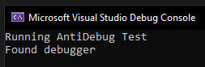

<h1 align="center">✨ Anti Debugging ✨</h1>

<h6 align="center"><em>Effective anti-analysis header for Windows</em></h6>

## 📝 Overview

[AntiDebug.hpp](./include/AntiDebug.hpp) is a header-only C++ library that helps protect your program from reverse engineering. It works by implementing a series of checks and prevention techniques to detect and prevent analysis tools.

The library implements a comprehensive set of techniques that target different aspects of the debugging process. By combining multiple detection methods, it creates a robust defense against reverse engineering attempts. Each method exploits specific characteristics of debugging environments, from hardware behavior to operating system structures and timing anomalies.

The aggressive countermeasures, such as the BSOD reaction, demonstrate the seriousness of the anti-debugging intent. While no single method is foolproof, the combination of multiple techniques significantly raises the bar for successful analysis, requiring debugger modifications, kernel-level interventions, or specialized tools to bypass.

This library is based off of my other security focused library,
<br>
please refer to it for more details: [Stack-Obfuscator](https://github.com/DontCallMeLuca/Stack-Obfuscator)

## ✨ Features
- **Hardware Breakpoint Detection**
- **PEB (Process Environment Block) Inspection**
- **Timing-Based Detection**
- **Virtual Machine Detection**
- **API Hooking**
- **Remote Debugger Detection**
- **Exception-Based Detection**
- **Known Debugger Process Detection**
- **Thread Hiding**
- **Memory Dump Prevention**
- **Anti-Dumping Detection**
- **Blue Screen (BSOD) Reaction**
- **Code Obfuscation**
- **Debug Port Detection**
- **Window Title Randomization**
- **Low performance overhead**
- **No external dependencies**
- **Modern C++ design**
- **Thoroughly tested**

## 🛠 Requirements
- MSVC Compiler
- Windows 10 or above
- x64 architecture platform
- C++20 support (Visual Studio 2019 16.8 or newer)

## 🚀 Installation
This module is a header-only module, simply include [AntiDebug.hpp](./include/AntiDebug.hpp) in your project:

```cpp
#include "AntiDebug.hpp"
```

## 💻 Usage

### 📚 Examples

_**Basic:**_

```cpp
#include "AntiDebug.hpp"

int main(void)
{
	AntiDebug::DoAllChecksAndPreventions();
	// Rest of the code...
}
```

_**Detect Debugger:**_

```cpp
#include "AntiDebug.hpp"

int main(void)
{
	if (AntiDebug::IsDebuggerDetected())
	{
		// Do something ...
	}

	// Rest of the code...
}
```

_**Detect Dumper:**_

```cpp
#include "AntiDebug.hpp"

int main(void)
{
	if (AntiDebug::IsDumperPresent())
	{
		// Do something ...
	}

	// Rest of the code...
}
```

_**Preventions:**_

```cpp
#include "AntiDebug.hpp"

int main(void)
{
	AntiDebug::PreventThreadInjection();
	AntiDebug::PreventMemoryDump();

	// Rest of the code...
}
```

_**Bluescreen:**_

```cpp
#include "AntiDebug.hpp"

int main(void)
{
	// Bluescreen
	AntiDebug::BSOD();
}
```

### ⭐ Best Practices

- Combine it with further security solutions
- Run all checks at the start of your program
- Use the bluescreen function if a debugger is present, or at the very least `__fastfail(1)`

## 🧪 Proof of Concept

Using the following code example:

```cpp
#include "AntiDebug.hpp"
#include <iostream>

int main(void)
{
	std::cout << "Running AntiDebug Test" << std::endl;

	AntiDebug::PreventThreadInjection();
	AntiDebug::PreventMemoryDump();

	if (AntiDebug::IsDumperPresent() || AntiDebug::IsDebuggerDetected())
		std::cout << "Found debugger" << std::endl;

	return 0;
}
```

Running it on a basic debugger:



Running it with x64dbg (a reverse engineering focused debugger), the debugger fails to attach.

## ⚠ Limitations

- Weak hypervisor detection
- No C support (for now)
- Not foolproof, no solution ever is
- Only for Windows x64 and the MSVC compiler

## 🔧 Technical Design & Implementation Details

###### _Warning: Only pain and suffering ahead_

### Hardware Breakpoint Detection

Hardware breakpoints are special registers (DR0-DR7) in x86/x64 processors that can trigger exceptions when execution reaches specific memory addresses. Debuggers commonly use these registers to set breakpoints without modifying the original code.

The implementation works by examining the debug registers through the thread context. When a debugger sets a hardware breakpoint, it modifies these registers, leaving a detectable fingerprint. By calling `GetThreadContext()` with `CONTEXT_DEBUG_REGISTERS` flag and checking if any of the debug registers (DR0-DR3, DR7) are non-zero, the code can detect if hardware breakpoints have been set.

This technique is particularly effective because hardware breakpoints are preferred by analysts over software breakpoints as they don't modify the code being debugged, making them otherwise harder to detect.

### PEB (Process Environment Block) Inspection

The PEB is a data structure maintained by the Windows operating system for each process. It contains various process-related information, including two fields specifically relevant to debugging:

1. `BeingDebugged`: A flag set to 1 when a debugger is attached to the process.
2. `NtGlobalFlag`: Located at offset 0xBC in the PEB, this contains flags that are modified when a process is created under a debugger.

The technique directly accesses the PEB through the Thread Environment Block (TEB) using the GS segment register (`__readgsqword(0x60)`). This approach is stealthy as it doesn't rely on easily detectable API calls like `IsDebuggerPresent()`.

Additionally, the code queries the process debug port using NtQueryInformationProcess with ProcessDebugPort class. When a debugger attaches to a process, Windows creates a debug port for communication between the two, making this a reliable detection method.

### Timing-Based Detection

Debuggers significantly slow down code execution due to the overhead of instruction tracing, breakpoint handling, and user interface updates. This technique exploits this performance discrepancy by measuring execution time of a simple operation.

The implementation works by:

1. Establishing a baseline CPU clock speed through `QueryPerformanceFrequency()` or a calibration method using `__rdtsc()` (Read Time-Stamp Counter).
2. Measuring the time taken to execute a trivial loop (incrementing a variable 1000 times).
3. Comparing the measured time against a threshold that's significantly higher than what would be expected on an undebugger system (30% of cycles for 1/10th of a second).

This is effective because the timing discrepancy between debugged and non-debugged execution is substantial enough to be reliably detected, even accounting for system load variations.

### Virtual Machine Detection

Many security researchers use virtual machines to analyze potentially malicious software. Detecting VM environments can be part of an anti-analysis strategy.
The implementation uses the CPUID instruction with leaf 1, which returns processor feature information. Specifically, it examines bit 31 of ECX register, which is the "Hypervisor Present Bit." When set, this indicates that the software is running within a virtualized environment.
This is a fundamental technique that leverages CPU-level information to determine the execution environment, making it difficult to circumvent without sophisticated VM technologies that hide virtualization indicators.

### API Hooking for Thread Injection Prevention

Debuggers and analysis tools often inject code into target processes using `CreateRemoteThread()`. By hooking this function, the anti-debugging mechanism can prevent such injections.

The implementation:

1. Locates the `CreateRemoteThread()` function in kernel32.dll
2. Saves the original bytes of the function
3. Overwrites the function prologue with a jump to a custom implementation that simply returns NULL and sets `ERROR_ACCESS_DENIED`

This technique effectively neutralizes a common vector for injecting debugging agents or monitoring code into the process. The hook uses a direct JMP instruction with an absolute address, making it efficient and difficult to bypass without first detecting and removing the hook.

### Remote Debugger Detection

This technique aims to detect when a debugger is attached to another process on the system, which might be monitoring the current process indirectly.

The implementation:

1. Creates a snapshot of all running processes using `CreateToolhelp32Snapshot()`
2. Iterates through each process (except itself)
3. Calls `CheckRemoteDebuggerPresent()` on each process to determine if it's being debugged

This approach can detect sophisticated debugging setups where the debugger is not directly attached to the target process but is analyzing it through another process.

### Exception-Based Detection

Debuggers typically intercept and handle exceptions, altering the normal exception flow. The anti-debugging code exploits this behavior using two specific exception types:

#### INT3 (0xCC) Detection

The `__debugbreak()` intrinsic generates an INT3 instruction, which is the standard breakpoint instruction. In normal execution, this would cause the exception handler to execute. Under a debugger, the debugger typically intercepts this exception, revealing its presence.

#### INT2D Detection

The INT2D instruction has special behavior in Windows: when executed without a debugger, it raises an exception that can be caught. When a debugger is present, it either behaves differently or causes system instability, allowing for detection.

These exception-based techniques are particularly effective because they leverage fundamental debugging mechanisms that are difficult to circumvent without sophisticated debugger modifications.

### Known Debugger Process Detection

This straightforward approach checks for the presence of known debugger processes running on the system.

The implementation:

Enumerates all running processes using `EnumProcesses()`
Retrieves the executable name of each process
Compares against a list of known debuggers and reverse engineering tools (IDA Pro, OllyDbg, x64dbg, WinDbg, etc.)

While simple, this technique is effective against standard analysis setups where the researcher hasn't taken steps to rename their tools. It provides a quick way to detect common analysis environments.

### Thread Hiding

The Windows kernel maintains information about threads that can be queried by debuggers. This technique makes the current thread "invisible" to debuggers.

The implementation uses the `NtSetInformationThread()` API with the `ThreadHideFromDebugger` class. When set, this prevents debuggers from receiving events related to the thread, effectively hiding it from debugger visibility.

What makes this technique particularly powerful is that it operates at the kernel level, making it difficult to circumvent without kernel-mode intervention.

### Memory Dump Prevention

Memory dumps are often used for offline analysis of software. This technique attempts to complicate memory acquisition.

By calling `SetProcessWorkingSetSize()` with parameters set to -1, the process working set is flushed to disk, making memory dumps less useful as important data may no longer be in physical memory.

While this isn't foolproof, it raises the technical bar for obtaining a clean memory image and can complicate automated analysis.

### Anti-Dumping Detection

This technique detects attempts to dump memory by checking for memory protection characteristics that might indicate a memory dumping tool is present.

The implementation calls `VirtualQuery()` on a known function address (itself) and checks if the PAGE_GUARD flag is set. This flag is sometimes used by memory dumping tools to monitor memory access, and its presence on code that shouldn't have this protection is suspicious.

This detection method targets a specific class of analysis tools that use memory guards for monitoring or extraction purposes.

## 📃 License

This project uses the `GNU GENERAL PUBLIC LICENSE v3.0` license
<br>
For more info, please find the `LICENSE` file here: [License](LICENSE)
